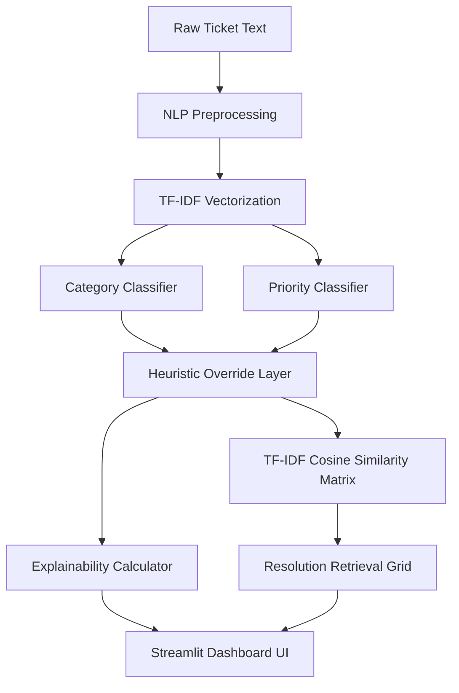

# Support Ticket Intelligence System 🎫

An end-to-end Machine Learning and Decision Intelligence system that automates ticket triage, priority routing, prediction explainability, and historical resolution retrieval for customer support centers.

---

## 📋 Project Context & Business Problem

Modern customer support desks handle a high volume of unstructured inquiries daily, ranging from simple product questions to critical database crashes and account cancellations. Triaging these tickets manually is:
*   **Time-Consuming**: Slows down response times, directly impacting customer satisfaction.
*   **Error-Prone**: Misrouted tickets increase internal transfer rates and extend resolution times.
*   **Costly**: Missing urgent billing or system-level issues increases customer churn.

This project solves this bottleneck by building an automated **Decision Intelligence Hub** that sits between incoming customer tickets and support agents. By leveraging Natural Language Processing (NLP) and supervised classification, the system instantly auto-classifies the ticket category, calculates response urgency, explains the prediction's underlying words, and recommends verified resolutions from past tickets.

---

## 🧠 Core Machine Learning Architecture

The system operates as an integrated pipeline that transforms unstructured input text into structured intelligence:



### 1. NLP Preprocessing Pipeline
To prepare raw ticket subjects and descriptions for machine learning, text is passed through a preprocessing pipeline (configured in `app/api/preprocessing.py`):
*   **Standardization**: Converted to lowercase and stripped of special characters, numbers, and excess whitespace.
*   **Tokenization**: Sentences are segmented into individual word tokens.
*   **Stopword Removal**: High-frequency words that lack semantic value (e.g., *the, is, at, which*) are filtered out.
*   **Lemmatization**: Tokens are processed using NLTK's WordNet Lemmatizer to reduce inflections back to their root dictionary form (e.g., *crashes, crashing, crashed* -> *crash*).

### 2. Dual-Classifier Modeling
*   **Ticket Category Classifier**: Predicts the functional department for the request (e.g., *Technical issue, Refund request, Billing inquiry, Cancellation request, Product inquiry*). It utilizes a TF-IDF (Term Frequency-Inverse Document Frequency) vectorizer combined with a trained classification model.
*   **Urgency Priority Classifier**: Predicts the support priority (*Critical, High, Medium, Low*).
*   **Deterministic Heuristics (Override Layer)**: In production environments, synthetic datasets can introduce label noise (e.g., classifying a billing dispute as low priority). To guarantee compliance with customer SLAs, a rule-based heuristic engine intercepts the predictions, elevating high-impact keywords (e.g., *cancel, charge, payment, failed*) to **High** or **Critical** priority.

### 3. Feature Importance & Local Explainability
To build agent trust, the system does not act as a black box. For every prediction:
*   The pipeline inspects the inner coefficients of the classification model for the predicted class.
*   It multiplies the model's class coefficients by the TF-IDF weights of the input text.
*   It extracts and ranks the top 5 words that made the strongest positive contributions to the prediction, rendering them in a horizontal feature importance chart.

### 4. Semantic Resolution Retrieval
To assist agents in closing tickets quickly, the system embeds a **Retrieval-Augmented Recommendation Engine**:
*   A pre-computed TF-IDF matrix is loaded for all historic, successfully resolved support tickets.
*   The system calculates the **Cosine Similarity** between the TF-IDF vector of the new ticket and the entire historical database.
*   It retrieves the top 3 most semantically similar tickets and displays their subjects, descriptions, and written resolutions in a side-by-side grid layout.

---

## 🎨 Interactive Dashboard Design

The frontend is a dark-mode Streamlit dashboard (`app/frontend/streamlit_app.py`) designed for single-frame readability:
1.  **Ticket Analysis Panel**: Accepts the ticket subject and description.
2.  **Part 1: Automated Ticket Categorization & Urgency**:
    *   **Category & Urgency Badges**: Dynamic status badges color-coded by urgency (Red for Critical, Yellow/Orange for High, Green for Low).
    *   **Customer Sentiment**: Evaluates customer mood based on text and priority (e.g., *Extremely Frustrated 🔴, Churn Risk 🟡, Satisfied/Calm 🟢*).
    *   **SLA Response Target**: Generates countdown targets (e.g., *15 Mins* for Critical, *1 Hour* for High, *12 Hours* for Low).
    *   **Support Playbooks**: Step-by-step resolution checklists customized for the ticket type.
3.  **Part 2: Explainability Factors**: Displays local feature contributions as a clean, native horizontal bar chart.
4.  **Part 3: Historical Resolutions**: Renders the top 3 similar past resolutions side-by-side in a responsive grid.

---

## 📁 Repository Structure

```text
├── app/
│   ├── api/
│   │   ├── preprocessing.py  # NLP text normalization, tokenization, & lemmatization
│   │   ├── schemas.py        # Pydantic request/response schemas
│   │   ├── inference.py      # Core classification, explainability, & retrieval loader
│   │   └── main.py           # FastAPI entrypoint and REST endpoints
│   └── frontend/
│       └── streamlit_app.py  # Dark-mode Streamlit dashboard (with API fallback)
├── data/                     # Raw datasets and clean resolution CSV files
├── models/                   # Serialized pickle files (classifiers, TF-IDF vectorizers, encoders)
├── notebooks/                # Jupyter workflow pipelines (EDA, modeling, explainability)
├── reports/                  # Evaluation figures and training plots
├── tests/                    # Integration test suite
├── requirements.txt          # Python package requirements
└── README.md                 # Project README
```

---

## ⚡ Local Setup

### 1. Installation
Set up a clean virtual environment and install all dependencies:
```bash
python3 -m venv .venv
source .venv/bin/activate
pip install -r requirements.txt
```

### 2. Run Backend API
Start the FastAPI server:
```bash
uvicorn app.api.main:app --host 127.0.0.1 --port 8000 --reload
```
You can access the interactive Swagger API documentation at `http://127.0.0.1:8000/docs`.

### 3. Run Streamlit Frontend
Start the Streamlit dashboard:
```bash
streamlit run app/frontend/streamlit_app.py --server.port 8501
```
The interface is now open at `http://localhost:8501`.

---

## 💡 Interactive Test Cases

To verify and demonstrate the dashboard's capabilities, try running these representative scenarios:

### 🚨 Case 1: Critical Technical System Failure
*   **Ticket Subject**: `Critical system crash on startup - installer wizard fails`
*   **Ticket Description**: `Our enterprise server experienced a critical application crash immediately after running the latest update. The database connection failed, causing a complete system freeze and halting support operations. We need immediate technical escalation.`
*   **Expected Results**: Categorized as **Technical issue**, Urgency rated **Critical**, Sentiment labeled **Extremely Frustrated (🔴)**, SLA target **15 Mins**, and displays active diagnostics next steps.

### 💳 Case 2: Billing Discrepancy & Refund Request
*   **Ticket Subject**: `Charged twice for annual enterprise plan renewal`
*   **Ticket Description**: `I noticed a duplicate subscription charge on our company credit card for the annual plan. Please look into this billing discrepancy and process a refund for the second transaction back to our account immediately.`
*   **Expected Results**: Categorized as **Refund request**, Urgency rated **High**, Sentiment labeled **Frustrated / Churn Risk (🟡)**, SLA target **1 Hour**, and initiates billing audit playbooks.

### 🟢 Case 3: Product Feedback & Feature Inquiry
*   **Ticket Subject**: `Feedback regarding keyboard shortcut preferences`
*   **Ticket Description**: `I am looking for some basic information about how to customize user preferences and default shortcuts in the application. I would love to see an option to map custom layout settings in the future. The product works great otherwise.`
*   **Expected Results**: Categorized as **Product inquiry**, Urgency rated **Low**, Sentiment labeled **Satisfied / Calm (🟢)**, SLA target **12 Hours**, and triggers documentation references.
